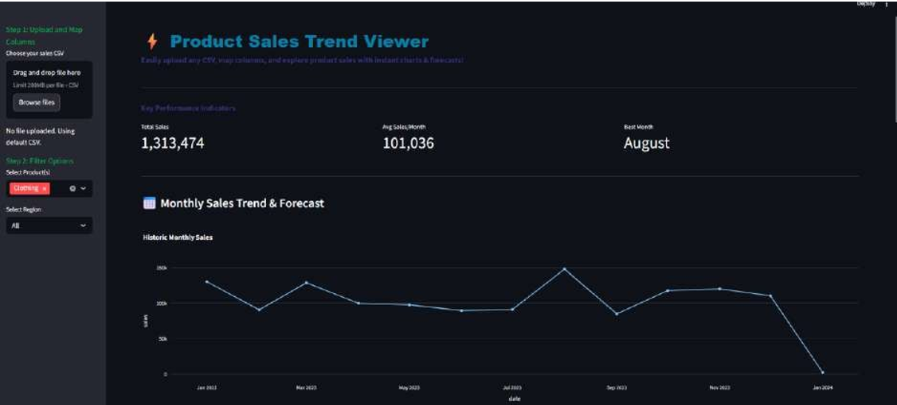
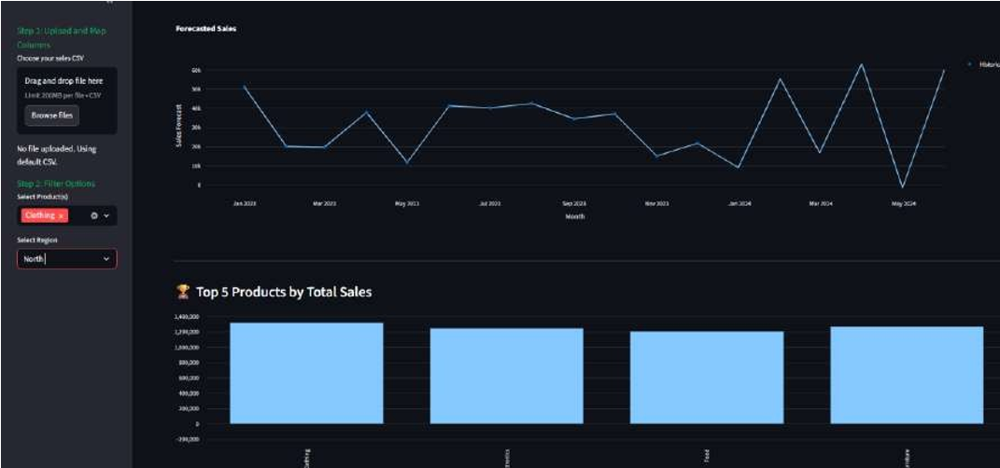
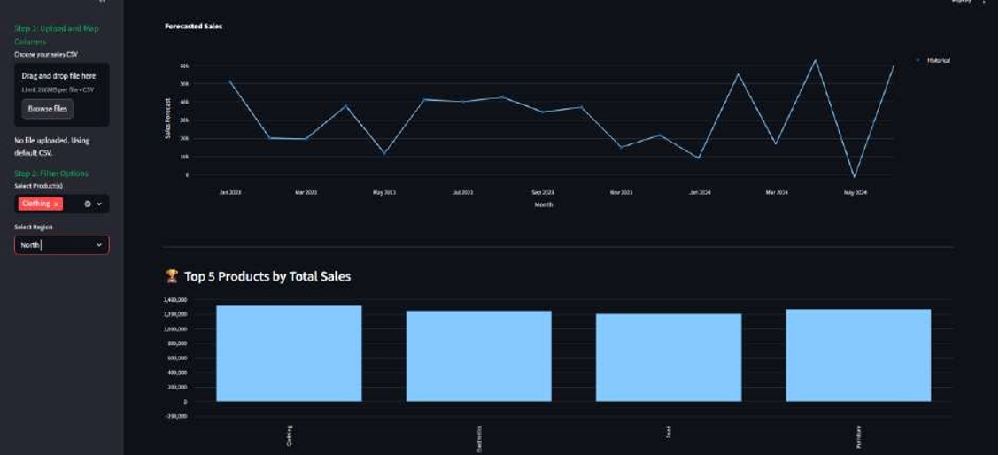
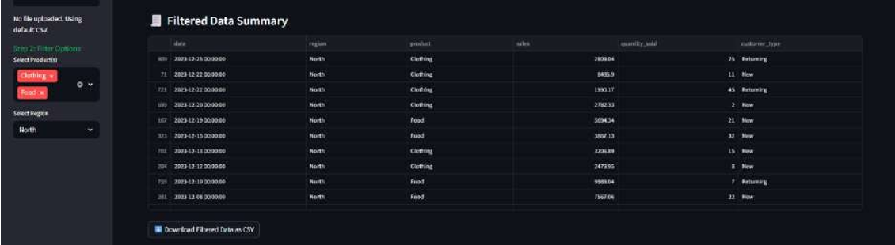

# 📊 Product Sales Trend Viewer


An interactive **Sales Analytics Dashboard** built using **Streamlit** that allows users to upload CSV files and visualize sales trends, forecasts, and key business insights.

---

## 📑 Table of Contents

- Overview
- Features
- Technology Stack
- Installation
- Usage
- Project Structure
- Screenshots

---

## 🎯 Overview

This project helps users analyze sales data easily by simply uploading a CSV file.  

It automatically:
- Cleans and processes data  
- Generates KPIs  
- Visualizes trends  
- Forecasts future sales  

---

## 🚀 Features

- 📂 Upload any CSV dataset  
- 📊 Automatic KPI calculation  
- 📈 Monthly Sales Trend visualization  
- 🔮 6-Month Sales Forecast (Prophet)  
- 🏆 Top 5 Products analysis  
- 🌍 Region-wise distribution  
- 📋 Filtered data table  

---

## 📸 Screenshots

### 🖥️ Dashboard Overview
<p align="center">
  
</p>

---

### 📈 Sales Trend & Forecast
<p align="center">
  
</p>

---

### 🏆 Top Products
<p align="center">
  
</p>

---

### 🌍 Region-wise Sales
<p align="center">
  
</p>

---

### 📋 Filtered Data Table
<p align="center">
  
</p>

## 🛠️ Technology Stack

- Python  
- Streamlit  
- Pandas  
- Matplotlib  
- Prophet  

---

## ⚙️ Installation

```bash
pip install -r requirements.txt
